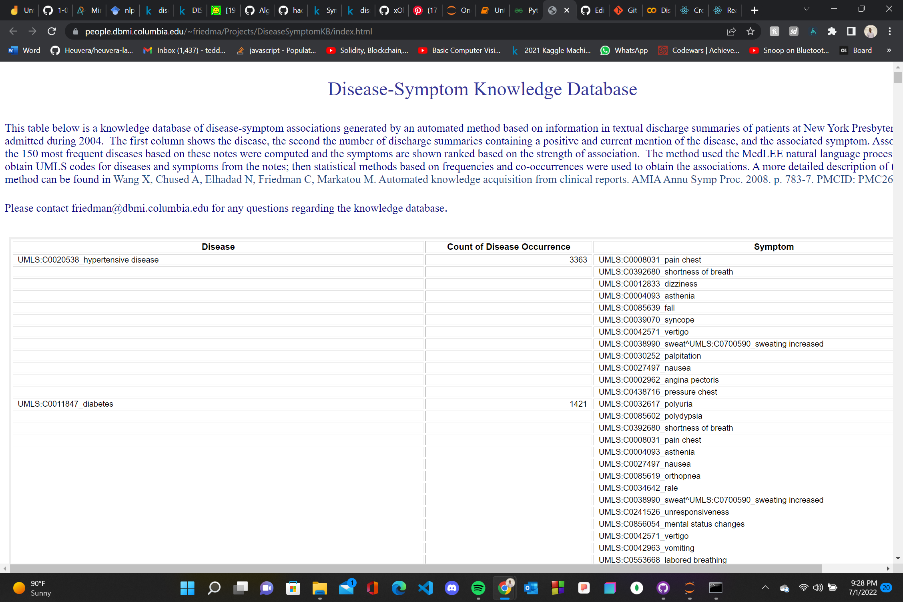
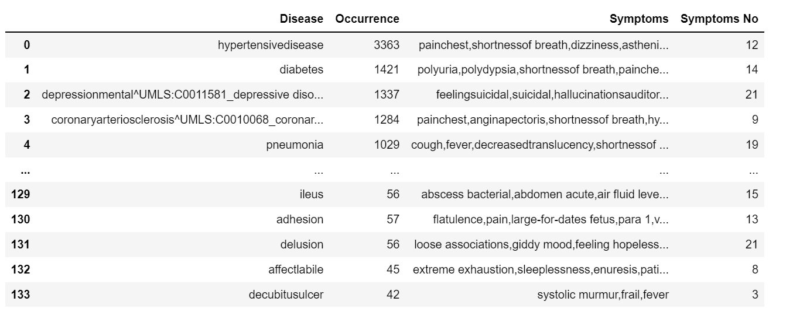

# Disease Data WebScrape Analysis
 
I was working on an NLP (Natural Language Processing) Disease Based on Symptoms Prediction Model, and needed a data source, so i used Python to scrape relevant information from [A page on Columbia University Website ](https://people.dbmi.columbia.edu/~friedma/Projects/DiseaseSymptomKB/index.html) and turned it to a dataframe.

## Data Source

## DataFrame / Result

